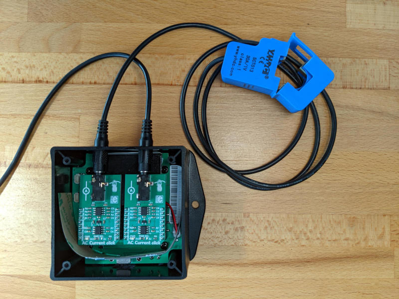

Golioth Reference Design Power Monitor
######################################

Overview
********

The Golioth IoT Power Monitor reference design includes two channels for
monitoring electrical equipment. Whether applied to machine tools on a
production floor, or the electrical circuits in a commercial/residential
setting, having data about electrical usage is a powerful tool for making
business decisions.

Readings from each channel are passed up to Golioth for tracking usage over
time. Live "run" time is also reported to show how long a machine has currently
been running. This data is also used to report the lifetime "run" time of the
equipment being monitored. The delay between readings and the threshold at
which the equipment is considered "off" are configurable from the Golioth cloud.

Local set up
************

Do not clone this repo using git. Zephyr's ``west`` meta tool should be used to
set up your local workspace.

Install the Python virtual environment (recommended)
====================================================

.. code-block:: console

   cd ~
   mkdir golioth-reference-design-powermonitor
   python -m venv golioth-reference-design-powermonitor/.venv
   source golioth-reference-design-powermonitor/.venv/bin/activate
   pip install wheel west

Use ``west`` to initialize and install
======================================

.. code-block:: console

   cd ~/golioth-reference-design-powermonitor
   west init -m git@github.com:golioth/reference-design-powermonitor.git .
   west update
   west zephyr-export
   pip install -r deps/zephyr/scripts/requirements.txt

This will also install the `golioth-zephyr-boards`_ definitions for the Golioth
Aludel-Mini.

Building the application
************************

Build Zephyr sample application for Golioth Aludel-Mini
(``aludel_mini_v1_sparkfun9160_ns``) from the top level of your project. After a
successful build you will see a new ``build`` directory. Note that any changes
(and git commmits) to the project itself will be inside the ``app`` folder. The
``build`` and ``deps`` directories being one level higher prevents the repo from
cataloging all of the changes to the dependencies and the build (so no
``.gitignore`` is needed)

During building, replace ``<your.semantic.version>`` to utilize the DFU
functionality on this Reference Design.

.. code-block:: console

   $ (.venv) west build -b aludel_mini_v1_sparkfun9160_ns app -- -DCONFIG_MCUBOOT_IMAGE_VERSION=\"<your.semantic.version>\"
   $ (.venv) west flash

Configure PSK-ID and PSK using the device shell based on your Golioth
credentials and reboot:

.. code-block:: console

   uart:~$ settings set golioth/psk-id <my-psk-id@my-project>
   uart:~$ settings set golioth/psk <my-psk>
   uart:~$ kernel reboot cold

Golioth Features
****************

This app implements:

* Over-the-Air (OTA) firmware updates
* LightDB State for tracking live runtime and cumulative runtime
* LightDB Stream for recording periodic readings from each channel
* Settings Service to adjust the delay between sensor readings and the ADC
  floor ("off" threshold above which a device will be considered "running")
* Remote Logging
* Remote Procedure call (RPC) to reboot the device

This reference design uses the following Settings Service keys. Add these
key/value pairs in the Device Settings menu of the `Golioth Console`_.

* ``LOOP_DELAY_S`` (seconds)
* ``ADC_FLOOR_CH0`` (raw ADC value)
* ``ADC_FLOOR_CH1`` (raw ADC value)

.. _Golioth Console: https://console.golioth.io
.. _golioth-zephyr-boards: https://github.com/golioth/golioth-zephyr-boards
